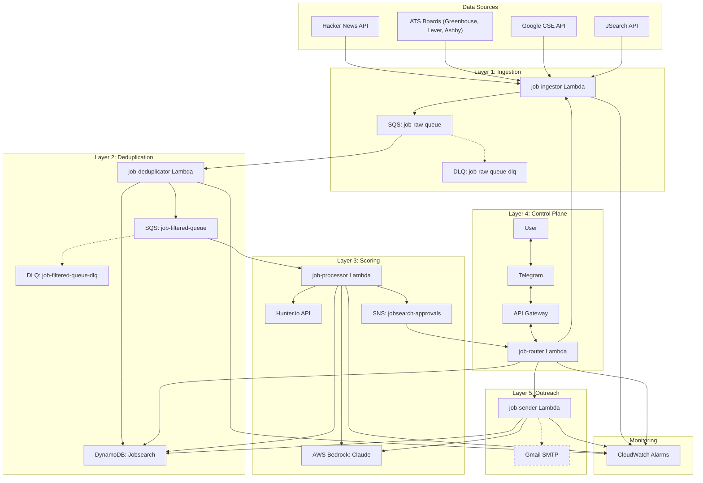
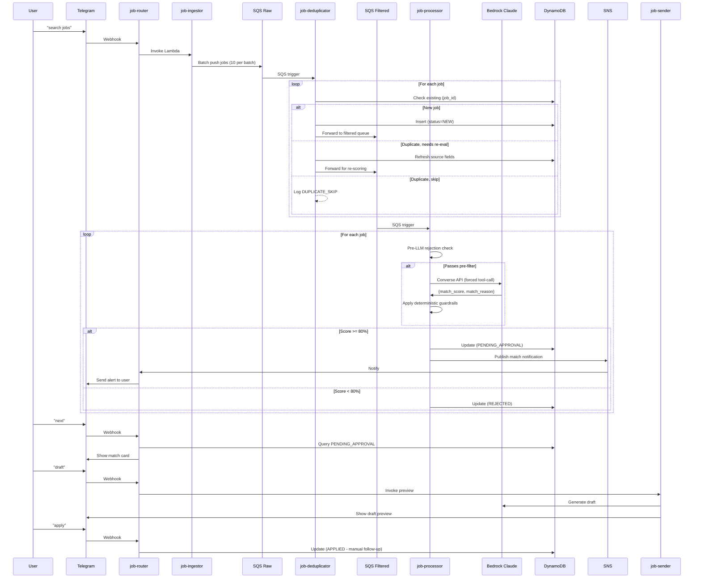
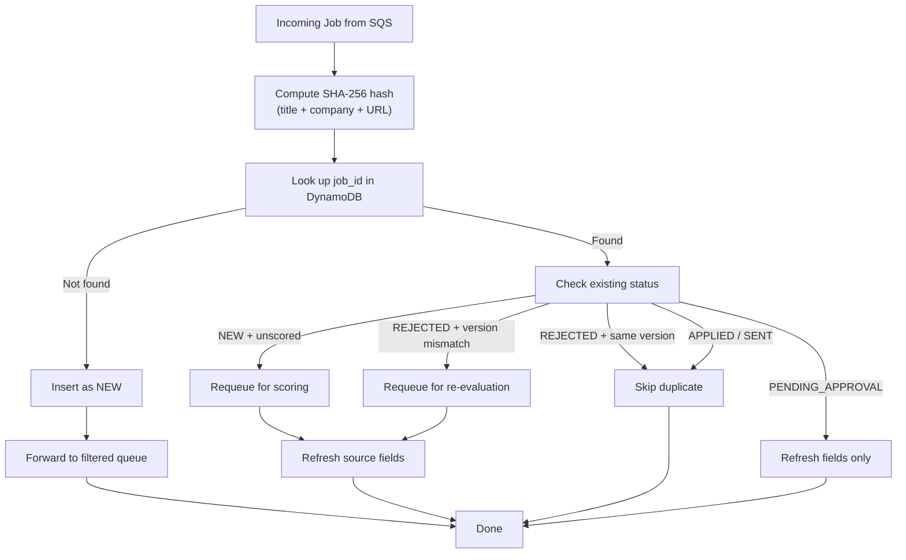
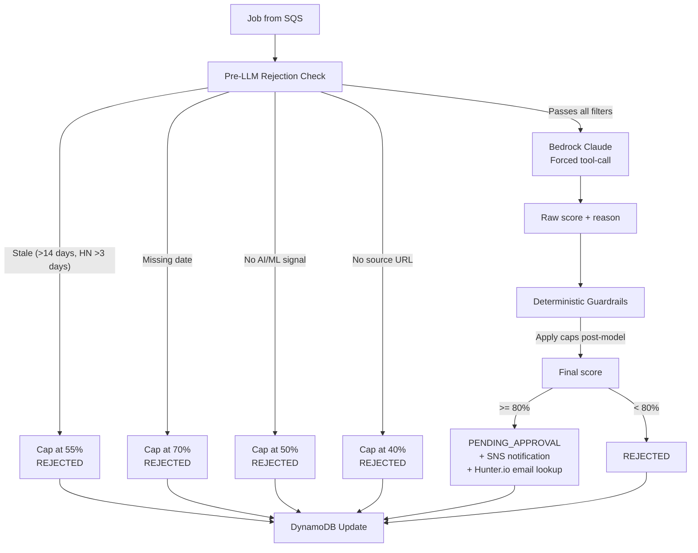
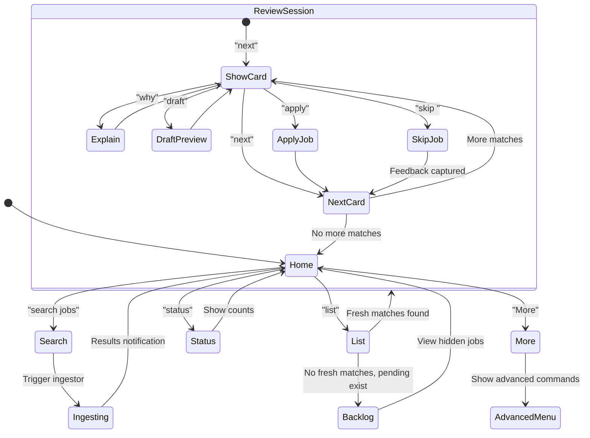
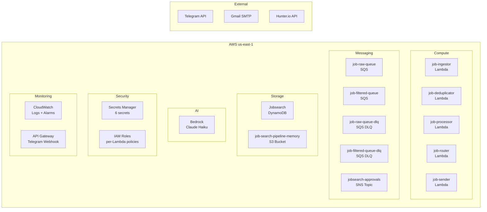
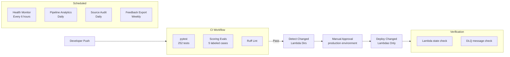

# Architecture Diagrams

## System Overview

```mermaid
graph TD
    subgraph "Data Sources"
        HN["Hacker News API"]
        ATS["ATS Boards (Greenhouse, Lever, Ashby)"]
        GCSE["Google CSE API"]
        JS["JSearch API"]
    end

    subgraph "Layer 1: Ingestion"
        ING["job-ingestor Lambda"]
        HN --> ING
        ATS --> ING
        GCSE --> ING
        JS --> ING
        ING --> SQS_RAW["SQS: job-raw-queue"]
        SQS_RAW_DLQ["DLQ: job-raw-queue-dlq"]
        SQS_RAW -.-> SQS_RAW_DLQ
    end

    subgraph "Layer 2: Deduplication"
        SQS_RAW --> DEDUP["job-deduplicator Lambda"]
        DEDUP --> DB["DynamoDB: Jobsearch"]
        DEDUP --> SQS_FILT["SQS: job-filtered-queue"]
        SQS_FILT_DLQ["DLQ: job-filtered-queue-dlq"]
        SQS_FILT -.-> SQS_FILT_DLQ
    end

    subgraph "Layer 3: Scoring"
        SQS_FILT --> PROC["job-processor Lambda"]
        PROC --> BEDROCK["AWS Bedrock: Claude"]
        PROC --> HUNTER["Hunter.io API"]
        PROC --> DB
        PROC --> SNS["SNS: jobsearch-approvals"]
    end

    subgraph "Layer 4: Control Plane"
        USER["User"] <--> TG["Telegram"]
        TG <--> APIGW["API Gateway"]
        APIGW <--> ROUTER["job-router Lambda"]
        SNS --> ROUTER
        ROUTER --> DB
        ROUTER --> ING
    end

    subgraph "Layer 5: Outreach"
        ROUTER --> SENDER["job-sender Lambda"]
        SENDER --> BEDROCK
        SENDER --> DB
        SENDER -.-> GMAIL["Gmail SMTP"]
    end

    subgraph "Monitoring"
        CW["CloudWatch Alarms"]
        ING & DEDUP & PROC & ROUTER & SENDER --> CW
    end

    style GMAIL stroke-dasharray: 5 5
```

## Message Flow

```mermaid
sequenceDiagram
    participant U as User
    participant T as Telegram
    participant R as job-router
    participant I as job-ingestor
    participant Q1 as SQS Raw
    participant D as job-deduplicator
    participant Q2 as SQS Filtered
    participant P as job-processor
    participant B as Bedrock Claude
    participant DB as DynamoDB
    participant SNS as SNS
    participant S as job-sender

    U->>T: "search jobs"
    T->>R: Webhook
    R->>I: Invoke Lambda
    I->>Q1: Batch push jobs (10 per batch)
    Q1->>D: SQS trigger

    loop For each job
        D->>DB: Check existing (job_id)
        alt New job
            D->>DB: Insert (status=NEW)
            D->>Q2: Forward to filtered queue
        else Duplicate, needs re-eval
            D->>DB: Refresh source fields
            D->>Q2: Forward for re-scoring
        else Duplicate, skip
            D-->>D: Log DUPLICATE_SKIP
        end
    end

    Q2->>P: SQS trigger

    loop For each job
        P->>P: Pre-LLM rejection check
        alt Passes pre-filter
            P->>B: Converse API (forced tool-call)
            B->>P: {match_score, match_reason}
            P->>P: Apply deterministic guardrails
        end

        alt Score >= 80%
            P->>DB: Update (PENDING_APPROVAL)
            P->>SNS: Publish match notification
            SNS->>R: Notify
            R->>T: Send alert to user
        else Score < 80%
            P->>DB: Update (REJECTED)
        end
    end

    U->>T: "next"
    T->>R: Webhook
    R->>DB: Query PENDING_APPROVAL
    R->>T: Show match card

    U->>T: "draft"
    T->>R: Webhook
    R->>S: Invoke preview
    S->>B: Generate draft
    S->>T: Show draft preview

    U->>T: "apply"
    T->>R: Webhook
    R->>DB: Update (APPLIED - manual follow-up)
```

## Deduplication Logic

```mermaid
flowchart TD
    START["Incoming Job from SQS"] --> HASH["Compute SHA-256 hash<br/>(title + company + URL)"]
    HASH --> LOOKUP["Look up job_id in DynamoDB"]

    LOOKUP -->|Not found| NEW["Insert as NEW"]
    NEW --> FORWARD["Forward to filtered queue"]
    FORWARD --> DONE["Done"]

    LOOKUP -->|Found| CHECK_STATUS["Check existing status"]

    CHECK_STATUS -->|"NEW + unscored"| REQUEUE_NEW["Requeue for scoring"]
    REQUEUE_NEW --> REFRESH["Refresh source fields"]
    REFRESH --> DONE

    CHECK_STATUS -->|"REJECTED + version mismatch"| REQUEUE_EVAL["Requeue for re-evaluation"]
    REQUEUE_EVAL --> REFRESH

    CHECK_STATUS -->|"REJECTED + same version"| SKIP["Skip duplicate"]
    SKIP --> DONE

    CHECK_STATUS -->|"PENDING_APPROVAL"| REFRESH_ONLY["Refresh fields only"]
    REFRESH_ONLY --> DONE

    CHECK_STATUS -->|"APPLIED / SENT"| SKIP
```

## Scoring Pipeline

```mermaid
flowchart TD
    JOB["Job from SQS"] --> PRE["Pre-LLM Rejection Check"]

    PRE -->|"Stale (>14 days, HN >3 days)"| REJECT_PRE["Cap at 55%<br/>REJECTED"]
    PRE -->|"Missing date"| REJECT_DATE["Cap at 70%<br/>REJECTED"]
    PRE -->|"No AI/ML signal"| REJECT_SIGNAL["Cap at 50%<br/>REJECTED"]
    PRE -->|"No source URL"| REJECT_URL["Cap at 40%<br/>REJECTED"]

    PRE -->|"Passes all filters"| LLM["Bedrock Claude<br/>Forced tool-call"]
    LLM --> SCORE["Raw score + reason"]
    SCORE --> GUARD["Deterministic Guardrails"]

    GUARD -->|"Apply caps post-model"| FINAL["Final score"]

    FINAL -->|">= 80%"| APPROVE["PENDING_APPROVAL<br/>+ SNS notification<br/>+ Hunter.io email lookup"]
    FINAL -->|"< 80%"| REJECT["REJECTED"]

    REJECT_PRE --> DB["DynamoDB Update"]
    REJECT_DATE --> DB
    REJECT_SIGNAL --> DB
    REJECT_URL --> DB
    APPROVE --> DB
    REJECT --> DB
```

## Telegram UX Flow

```mermaid
stateDiagram-v2
    [*] --> Home

    Home --> Search: "search jobs"
    Home --> List: "list"
    Home --> Status: "status"
    Home --> More: "More"

    Search --> Ingesting: Trigger ingestor
    Ingesting --> Home: Results notification

    List --> ReviewSession: Fresh matches found
    List --> Backlog: No fresh matches, pending exist

    Status --> Home: Show counts
    More --> AdvancedMenu: Show advanced commands

    state ReviewSession {
        [*] --> ShowCard: "next"
        ShowCard --> Explain: "why"
        ShowCard --> DraftPreview: "draft"
        ShowCard --> ApplyJob: "apply"
        ShowCard --> SkipJob: "skip <reason>"
        ShowCard --> NextCard: "next"

        Explain --> ShowCard
        DraftPreview --> ShowCard
        ApplyJob --> NextCard
        SkipJob --> NextCard: Feedback captured
        NextCard --> ShowCard: More matches
        NextCard --> Home: No more matches
    }

    Backlog --> Home: View hidden jobs
```

## Infrastructure

```mermaid
graph LR
    subgraph "AWS us-east-1"
        subgraph "Compute"
            L1["job-ingestor<br/>Lambda"]
            L2["job-deduplicator<br/>Lambda"]
            L3["job-processor<br/>Lambda"]
            L4["job-router<br/>Lambda"]
            L5["job-sender<br/>Lambda"]
        end

        subgraph "Messaging"
            Q1["job-raw-queue<br/>SQS"]
            Q2["job-filtered-queue<br/>SQS"]
            D1["job-raw-queue-dlq<br/>SQS DLQ"]
            D2["job-filtered-queue-dlq<br/>SQS DLQ"]
            SNS1["jobsearch-approvals<br/>SNS Topic"]
        end

        subgraph "Storage"
            DDB["Jobsearch<br/>DynamoDB"]
            S3["job-search-pipeline-memory<br/>S3 Bucket"]
        end

        subgraph "AI"
            BR["Bedrock<br/>Claude Haiku"]
        end

        subgraph "Security"
            SM["Secrets Manager<br/>6 secrets"]
            IAM["IAM Roles<br/>per-Lambda policies"]
        end

        subgraph "Monitoring"
            CW["CloudWatch<br/>Logs + Alarms"]
            AG["API Gateway<br/>Telegram Webhook"]
        end
    end

    subgraph "External"
        TG2["Telegram API"]
        GM["Gmail SMTP"]
        HU["Hunter.io API"]
    end
```

## CI/CD Pipeline

```mermaid
flowchart LR
    DEV["Developer Push"] --> CI["CI Workflow"]

    subgraph CI["CI Workflow"]
        TEST["pytest<br/>252 tests"]
        EVAL["Scoring Evals<br/>5 labeled cases"]
        LINT["Ruff Lint"]
    end

    CI -->|Pass| DETECT["Detect Changed<br/>Lambda Dirs"]
    DETECT --> APPROVE["Manual Approval<br/>production environment"]
    APPROVE --> DEPLOY["Deploy Changed<br/>Lambdas Only"]
    DEPLOY --> VERIFY["Post-Deploy<br/>Health Check"]

    subgraph VERIFY["Verification"]
        V1["Lambda state check"]
        V2["DLQ message check"]
    end

    subgraph "Scheduled"
        HEALTH["Health Monitor<br/>Every 6 hours"]
        ANALYTICS["Pipeline Analytics<br/>Daily"]
        SOURCE["Source Audit<br/>Daily"]
        FEEDBACK["Feedback Export<br/>Weekly"]
    end
```
